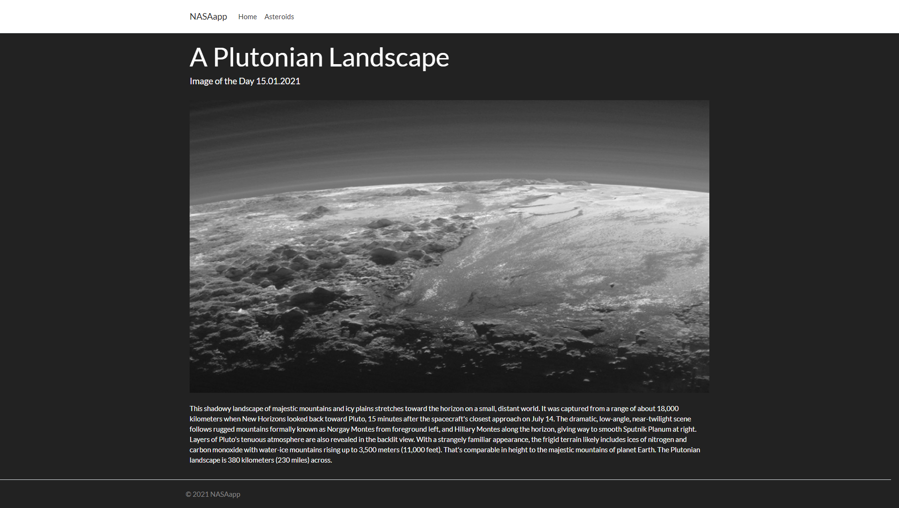
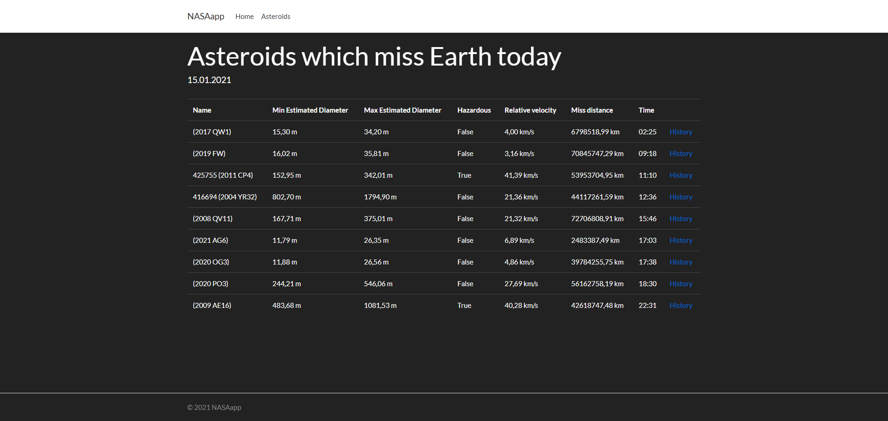
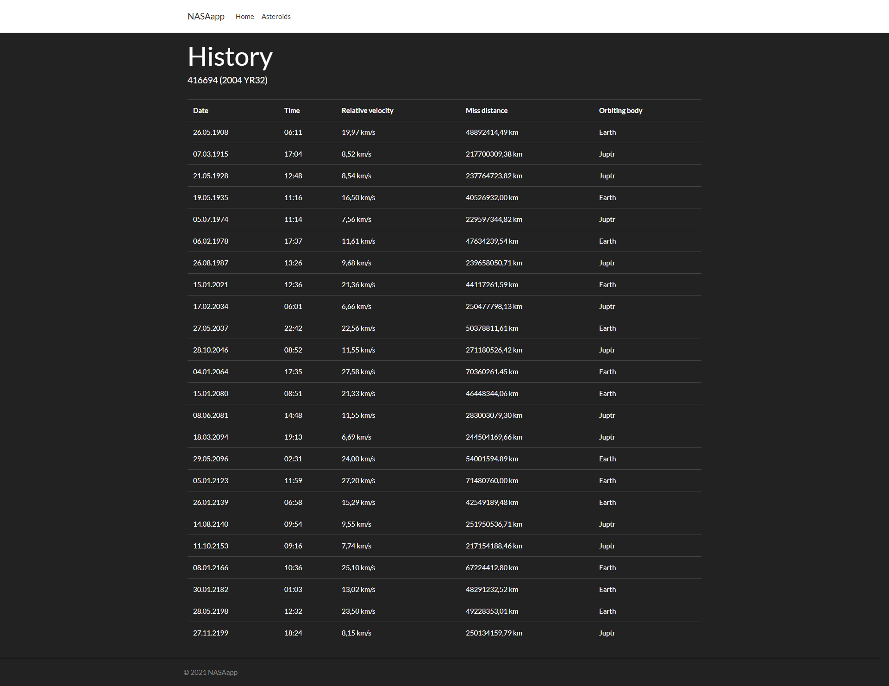

# NASAapp
NASAapp is a web aplication which uses NASA WebApi to display photos with description and show asteroids which miss Earth today. Each asteroid has its own observation history.

Application is hosted on Azure: https://nasaapp.azurewebsites.net

## Technologies
* C#
* ASP.NET Core MVC
* .NET Framework 5.0
* HTML, CSS, JavaScript
* Bootstrap

## Home view

## Asteroids view

## History view

