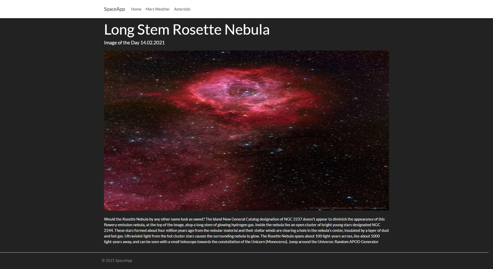
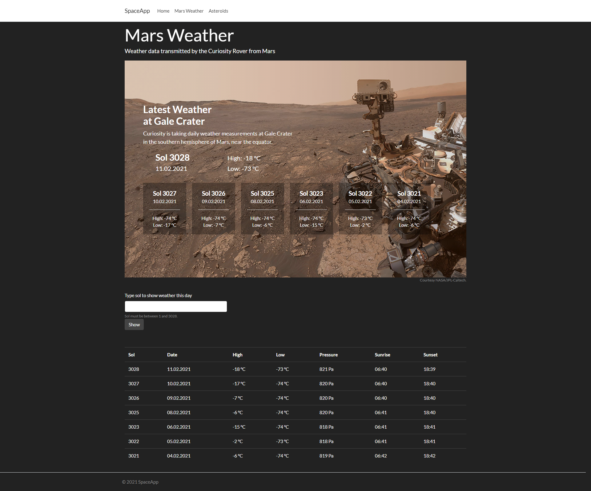

# SpaceApp
SpaceApp is a web aplication which shows astronomy picture of the day with description, current Mars weather and asteroids which miss earth. App uses NASA WebApi to provide data.

Application is hosted on Azure: https://spaceapplication.azurewebsites.net

## Technologies
* C#
* ASP.NET Core MVC
* .NET Framework 5.0
* HTML, CSS
* Bootstrap

## Home view

## Mars weather view

## Asteroids view

